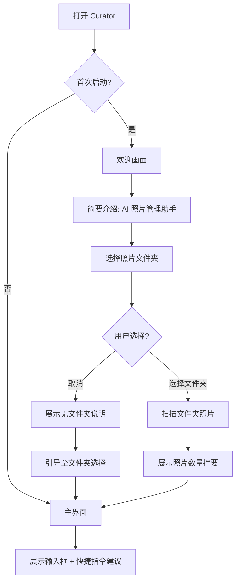
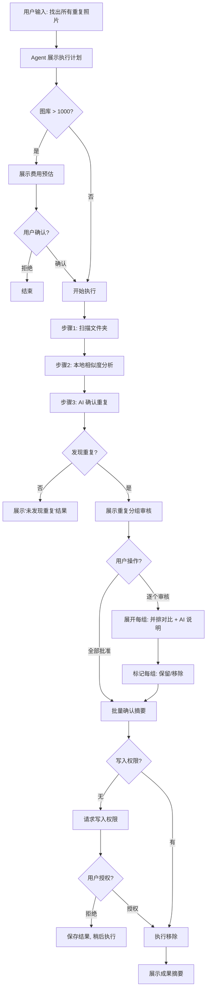
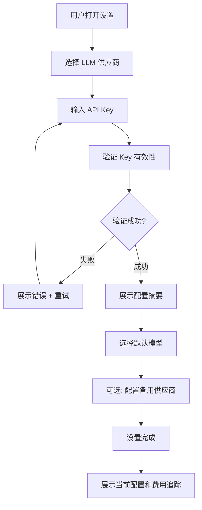

# UX 设计规格 — Curator

**作者:** Nick
**日期:** 2026-04-18

---

## Executive Summary

### Project Vision

Curator 是一款原生 macOS 照片管理 Agent，用自然语言指令替代整个专业照片工具链。用户通过描述需求来管理照片——AI Agent 负责规划工作、透明执行，并在关键操作前等待确认。这不是一个碰巧处理照片的聊天应用，而是一个 Agent 工作空间，核心范式从"用户操作工具"转变为"用户表达意图，Agent 自主执行"。照片来源可插拔，MVP 支持本地文件夹，后续扩展 Apple 照片图库等。

产品同时承担双重使命：作为消费级照片管理工具验证市场，作为 OpenAgentSDKSwift 的旗舰应用验证 SDK 能力。

### Target Users

Mac 用户，拥有 1000+ 照片的大型图库，认为 Apple 照片太基础而专业工具（Lightroom、Photoshop）太复杂。技术水平跨度大：

- **典型用户（小张/小李）：** 30 岁左右，有大量照片管理需求但不愿学习复杂工具。期望"告诉它我要什么，它帮我搞定"
- **怀疑型用户（老王）：** 对 AI 持谨慎态度，需要从小范围只读操作开始，渐进建立信任
- **技术型用户（Alex）：** 开发者背景，想控制 API Key、模型选择和成本，期望深度配置能力

共同特征：想要专业级效果，不想学专业级工具。

### Key Design Challenges

1. **信任是首要障碍。** 照片是极度私人化的数据。UX 必须在第一次交互就传递安全感——只读默认、透明的权限说明、清晰的隐私边界。信任建立不是一步到位，而是从安全探索到自信操作的渐进弧线。
2. **自然语言不是聊天窗口。** 这是 Agent 工作空间，不是聊天机器人。输入框是入口，但主舞台是 Agent 执行过程的可视化——进度、推理、结果展示。交互模型需要重新定义，而非照搬聊天 UI 模式。
3. **复杂度的渐进式揭示。** 用户从简单只读分析（"找出模糊照片"）到批量删除操作（"清理所有重复"），UI 需要自然地跟随信任曲线——新手看到简洁安全，进阶用户获得强大控制。

### Design Opportunities

1. **"看见 Agent 思考"。** 市面上所有 AI 照片工具都是黑盒。展示 Agent 推理过程（为什么标记为重复、为什么建议这个名称）不仅是功能，更是差异化竞争优势。透明度 = 信任 = 付费意愿。
2. **视觉证据驱动决策。** 去重结果用并排对比，重命名建议配上缩略图预览。用户基于视觉证据做决策，而非盲信 AI。这让"审核"变成自然、高效的动作，而非负担。
3. **macOS 原生身份。** SwiftUI + macOS 15+ 的原生体验——不是 Electron 套壳，不是 Web 应用。Mac 用户对原生质感有高期望，满足这种期望本身就是竞争力。

## Core User Experience

### Defining Experience

核心体验循环：**用户输入自然语言意图 → Agent 自主规划并执行多步工作流 → 实时可视化进度和推理 → 展示结果供审核 → 用户确认执行。**

这不是聊天循环，而是"意图 → 执行 → 审核 → 行动"的 Agent 工作循环。输入框是入口，但主舞台是 Agent 执行过程的可视化——进度条、推理气泡、结果卡片。用户不是在和 AI 对话，而是在指挥一个智能助手工作。

### Platform Strategy

- **平台：** macOS 15+（Sequoia）原生桌面应用，仅 Apple Silicon（arm64）
- **交互模式：** 键盘 + 鼠标/触控板为主，不支持触摸屏
- **UI 框架：** SwiftUI 为主体，AppKit 互操作用于文件系统访问和系统集成
- **离线：** 本地操作（浏览、感知哈希、元数据分析）支持离线；LLM 功能需网络
- **系统能力：** 文件夹访问（MVP）、PhotoKit 集成（MVP 后）、Finder 拖放、通知中心、菜单栏图标（MVP 后）
- **分发：** DMG 网站下载，Sparkle 自动更新，非 App Store

### Effortless Interactions

1. **Agent 工作编排完全自动化。** 用户只需说"清理重复照片"，Agent 自动规划扫描 → 分析 → 分组 → 呈现。用户不需要知道步骤顺序或技术细节。
2. **成本预估自动展示。** 大规模操作执行前，系统自动计算并展示预估 API 费用。用户不需要主动查询成本。
3. **结果审核视觉化。** 去重结果用并排对比照片展示，重命名建议配缩略图。用户一眼看懂 AI 在建议什么，不需要阅读文字描述。
4. **权限渐进授权。** 应用以只读启动，需要写入时自然地提示升级。不一次性要求所有权限。

### Critical Success Moments

1. **首次 Agent 执行可视化（60 秒内）。** 用户输入第一个指令后，看到 Agent 实时扫描、分析、推理的过程。这是"顿悟时刻"——用户意识到"这东西真的在干活"。如果这一刻延迟超过 60 秒或无可视化，产品价值感知崩溃。
2. **首次审核通过的精确度。** Agent 展示去重结果时，用户检查前几组发现准确度很高。这是信任建立的关键——如果前几个结果有误，用户会怀疑所有后续结果。
3. **首次批量确认。** 用户无焦虑地点击"全部批准"执行批量删除或重命名。如果审核界面不够清晰或缺少安全网（撤销），这个时刻永远不会到来。

### Experience Principles

1. **意图驱动，而非功能驱动。** 用户不应该需要知道"去重"功能在哪里——他们只需要描述想要的结果。界面围绕用户意图组织，而非功能菜单。
2. **透明即信任。** Agent 的每一步都可见——在做什么、为什么这样做、进度如何。不透明 = 不信任 = 用户流失。
3. **渐进承诺。** 从只读探索到单条确认到批量操作，用户按自己的节奏建立信任。永远不在用户准备好之前展示复杂操作。
4. **原生质感，非 Web 套壳。** 利用 SwiftUI 动画、macOS 设计语言、系统原生控件。性能和视觉质感必须匹配用户对 Mac 应用的期望。

## Desired Emotional Response

### Primary Emotional Goals

1. **掌控感（Empowerment）。** 用户应该感到"我能管理我的照片了"——不是 AI 替他们做决定，而是 AI 让他们能做以前做不了的事。用户始终是决策者，Agent 是执行者。
2. **信任感（Trust）。** 从第一次打开应用到第一次批量操作，用户需要感到安全。每个操作都有清晰的解释、预览和撤销路径。信任是产品存在的基础。
3. **满足感（Accomplishment）。** 完成一个任务后（清理重复、重命名照片），用户应该感到"我的照片库变好了"——切实的进步感，而非模糊的"AI 做了什么"。

### Emotional Journey Mapping

| 阶段 | 目标情绪 | 避免 |
|------|---------|------|
| 首次启动 | 好奇 + 安全感 | 压迫、数据焦虑 |
| 权限授予 | 理解 + 安心 | 困惑、被胁迫 |
| 首次指令 | 期待 + 信心 | 怀疑、"这能行吗" |
| Agent 执行中 | 惊喜 + 满意 | 焦虑、无所适从 |
| 结果审核 | 认同 + 胜任 | 困惑、信息过载 |
| 确认执行 | 自信 + 果断 | 犹豫、后悔 |
| 任务完成 | 成就 + 满足 | 空虚、"就这？" |
| 再次使用 | 习惯 + 信赖 | 疲惫、觉得麻烦 |

### Micro-Emotions

**核心情绪对：**

1. **信任 vs 怀疑** — 最关键的情绪对。每一次 Agent 交互都在这对情绪之间摇摆。信任通过透明度、精确度和可控性建立。怀疑通过黑盒行为、错误结果和不可逆操作触发。
2. **信心 vs 困惑** — 用户需要理解 Agent 在做什么。清晰的进度展示和推理说明建立信心。技术术语和无反馈的等待导致困惑。
3. **安心 vs 焦虑** — 破坏性操作（删除）是焦虑的来源。明确的预览、撤销机制和"只读优先"策略创造安心。

### Design Implications

- **掌控感 →** 所有破坏性操作需用户确认；结果可审核；操作可撤销
- **信任感 →** Agent 推理可见；隐私说明前置；权限渐进授权
- **满足感 →** 任务完成时展示明确的成果摘要（删除了多少重复、节省多少空间）；视觉化的前后对比

### Emotional Design Principles

1. **安全感先于能力展示。** 先让用户感到安全，再展示 Agent 的强大。不要在首次启动就推送激进操作。
2. **每一步都传递"你说了算"。** 按钮文案用"执行"而非"确认删除"——强调用户的主导权。Agent 用"我建议..."而非"我将..."。
3. **完成时刻需要仪式感。** 任务完成不是静默消失，而是短暂的视觉庆祝 + 成果摘要卡片。让用户感到"我做了一件了不起的事"。

## UX Pattern Analysis & Inspiration

### Inspiring Products Analysis

**1. Claude Desktop（AI 对话模式）**
- **学什么：** 流式响应的视觉处理——文字逐字出现而非等待整段完成。这创造了"AI 在思考"的实时感
- **不学什么：** 纯对话界面。Curator 不是聊天应用，Agent 执行需要结构化的可视化，而非滚动式消息流

**2. Apple 照片（原生平台标杆）**
- **学什么：** 缩略图网格的性能和流畅度（60fps 滚动）、照片选择的自然手势、macOS 原生视觉语言
- **不学什么：** 静态的、规则驱动的组织方式。Curator 要在 Apple 照片的基础上叠加智能层

**3. Linear（进度与状态可视化）**
- **学什么：** 复杂工作流的简洁状态展示——每个任务有清晰的进度、状态标签和流转路径。Agent 多步工作流需要类似的可视化
- **不学什么：** Linear 面向团队协作，Curator 是个人工具，不需要团队状态

**4. Warp Terminal（现代命令行）**
- **学什么：** 将传统文本交互现代化——命令输入有自动补全、历史记录、分块展示。自然语言输入可以从这种模式借鉴
- **不学什么：** 终端的开发者为唯一受众的设计哲学

### Transferable UX Patterns

**Agent 执行可视化（来自 Linear + CI/CD 工具）：**
- 步骤列表式进度：每步有状态图标（等待/执行中/完成/失败）
- 实时日志流：关键信息实时显示在对应步骤下
- 进度量化：已处理/总数、百分比、预估剩余时间

**视觉对比展示（来自 diff 工具 + 照片编辑器）：**
- 并排对比模式：左右或上下并排放置原始和建议
- 差异高亮：用视觉标记突出关键差异
- 批量操作卡片：每个操作项是一张可独立审核的卡片

**自然语言输入（来自 Spotlight + ChatGPT）：**
- 单行输入框 + 展开式响应区
- 快捷指令建议（placeholder 文本引导首次使用）
- 输入历史和复用

### Anti-Patterns to Avoid

1. **聊天式滚动流。** 不要把 Agent 执行过程设计成无尽的聊天消息。这导致信息淹没、难以回顾和审核。用结构化的步骤卡片代替消息气泡。
2. **一次性权限轰炸。** 不要在首次启动时要求过多权限。MVP 只需文件夹访问，按需请求，渐进授权。
3. **无预览的批量操作。** 永远不要显示"删除 34 张照片？"这种无上下文的确认对话框。必须展示具体影响——至少是缩略图预览。
4. **技术术语暴露给用户。** 不要在 UI 中出现"pHash"、"LLM API"、"感知哈希"等术语。用"分析照片相似度"、"AI 分析"等用户友好的表述。

### Design Inspiration Strategy

**采纳：** Apple 照片的网格性能和原生视觉语言；Linear 的步骤式进度可视化；Spotlight 的简洁输入模型

**适配：** Claude Desktop 的流式响应——从文本流改为结构化的步骤卡片流；Warp 的命令历史——从命令行历史改为自然语言指令历史

**规避：** 纯聊天界面模式；规则驱动的静态分类；无上下文的批量确认对话框

## Design System Foundation

### Design System Choice

**macOS 原生设计系统（Apple Human Interface Guidelines + SwiftUI 组件库）**

Curator 是 macOS 原生应用，设计系统直接采用 Apple HIG 和 SwiftUI 内置组件。这不是妥协——macOS 用户期望原生体验，使用系统设计语言是最佳选择。

### Rationale

1. **平台一致性。** Mac 用户对原生应用有明确的视觉期望。使用 SwiftUI 系统控件确保应用"感觉像 Mac 应用"——窗口管理、控件样式、动画曲线都遵循用户已建立的肌肉记忆。
2. **开发效率。** SwiftUI 提供完整的组件库（按钮、列表、网格、表单、工具栏），减少自定义组件的维护成本。团队可以专注于 Agent 特有的 UI 创新。
3. **无障碍性内置。** SwiftUI 组件自带 VoiceOver 支持、动态字体、键盘导航和高对比度模式。基础无障碍零成本。
4. **Swift 原生。** 与 OpenAgentSDKSwift 同一技术栈，无需桥接或封装。

### Implementation Approach

- **基础组件：** 100% SwiftUI 系统控件（Button、List、Grid、Toolbar、Sheet 等）
- **自定义组件：** 仅在系统组件无法满足时构建——主要是 Agent 执行可视化相关组件
- **设计 Token：** 通过 SwiftUI 的 `@AppStorage` 和 Color/Font 扩展定义语义化 token，确保一致的主题适配（亮色/暗色模式、强调色）

### Customization Strategy

- 遵循 macOS 亮色/暗色/自动主题切换，不自定义窗口装饰
- 使用系统强调色（用户在系统设置中选择的颜色）作为主色调
- Agent 特有的视觉元素（执行步骤卡片、推理气泡、进度指示器）使用自定义设计，但与系统视觉语言协调

## Defining Core Experience

### Defining Experience

**"告诉 Curator 你要什么，然后看着它干活。"**

如果 Curator 的核心体验用一句话描述：用户用自然语言表达意图，Agent 自主编排并执行工作流，用户审核结果并做最终决策。

类比：如果 Tinder 的核心体验是"右滑匹配"，Curator 的核心体验是"说一句话，看 AI 干活"。用户向朋友推荐时会说："我告诉它找出重复照片，它真的帮我找到了。"

### User Mental Model

**用户带入的心智模型：**
- "这像 Siri，但只管照片，而且更聪明"——语音助手式交互期望
- "我应该能告诉它我想做什么"——自然语言交互是核心期望
- "它应该先展示给我看，不会偷偷删东西"——安全期望来自对 AI 的普遍不信任

**用户当前解决方案的痛点：**
- 手动整理：耗时、枯燥、2 小时后放弃
- PowerPhotos/PhotoSweeper：规则死板、不理解内容、界面过时
- Apple 照片自动分类：类别固定、不智能、无法自定义

**期望的魔法时刻：** 输入"找出重复照片"后，60 秒内看到 Agent 在真正扫描和分析自己的照片——不是预设结果，是实时的、针对自己照片的分析。

### Success Criteria

1. **"这东西真的在干活"——** 首次 Agent 执行在 60 秒内展示有意义的分析结果
2. **"它理解我"——** 90% 的自然语言指令无需重新措辞即可被正确解析
3. **"结果靠谱"——** 前几个去重/重命名结果足够准确，用户愿意继续审核
4. **"我掌控一切"——** 用户在任何时候都感到自己可以做最终决策

### Novel UX Patterns

Curator 需要创新的核心模式：**Agent 执行可视化面板。**

这不是传统的进度条或加载动画。它是一个实时的、可展开的执行日志，展示 Agent 的"思考过程"：

- **步骤卡片：** 每个执行步骤是一张卡片，显示当前状态（等待/执行中/完成/需要用户输入）
- **推理气泡：** Agent 的关键推理以简洁的气泡形式展示（"发现 47 组潜在重复，用 AI 确认了 34 组"）
- **进度量化：** 每步有具体的数字（已扫描 3,200/15,000 张）

这个模式介于 CI/CD 流水线可视化和聊天消息流之间——结构化但不死板，实时但不混乱。

### Experience Mechanics

**核心交互流程——"找出重复照片"为例：**

**1. 发起（Initiation）：**
- 用户在输入框键入"找出所有重复照片"
- 输入框支持多行但不默认——保持简洁的单行外观
- 可选的快捷指令建议出现在输入框上方（首次使用时）

**2. Agent 规划（Planning）：**
- Agent 展示执行计划卡片："我将分 3 步完成：1. 扫描文件夹 2. 分析相似度 3. 确认重复。预计 5 分钟。开始？"
- 用户看到计划后点击"开始"——明确授权
- 如果图库很大（5000+），自动展示费用预估

**3. 执行可视化（Execution）：**
- 执行面板展开，显示步骤卡片和实时进度
- 每个步骤实时更新数字和状态
- Agent 的中间发现以推理气泡形式出现
- 用户可以随时点击"取消"

**4. 结果审核（Review）：**
- 执行完成后，结果以卡片列表形式展示
- 每组重复是一张可展开的卡片：两张照片并排 + AI 匹配说明
- 用户可以逐个批准/拒绝，或批量操作

**5. 确认执行（Confirmation）：**
- 批量操作前展示摘要："将移除 34 组重复照片（保留每组最佳的一张）"
- 明确的"执行"按钮 + 撤销说明
- 执行完成后展示成果卡片

## Visual Design Foundation

### Color System

**基于 macOS 系统语义色，不自定义品牌色板。**

- **主色调：** 系统强调色（用户在系统设置中选择的蓝色/紫色/绿色等）
- **语义色：**
  - 成功：系统绿色（`Color.green`）
  - 警告：系统橙色（`Color.orange`）
  - 危险/删除：系统红色（`Color.red`）
  - 信息：系统蓝色（`Color.blue`）
  - Agent 推理：系统灰色（`Color.secondary`）
- **背景色：** 系统背景（自动适配亮色/暗色模式）
- **Agent 强调色：** 略微区别于系统强调色的自定义色（如靛蓝色），用于标识 Agent 生成的内容

**对比度要求：** 所有文本满足 WCAG AA 标准（4.5:1 常规文本，3:1 大文本）

### Typography System

**使用 SF Pro 系统字体族——macOS 的默认字体。**

| 层级 | 字体 | 字重 | 大小 | 用途 |
|------|------|------|------|------|
| 大标题 | SF Pro Display | Bold | 28pt | 首次启动、空状态标题 |
| 标题 | SF Pro Display | Semibold | 20pt | 面板标题、设置页标题 |
| 小标题 | SF Pro Text | Semibold | 15pt | 卡片标题、分组标题 |
| 正文 | SF Pro Text | Regular | 13pt | 描述文本、Agent 消息 |
| 辅助 | SF Pro Text | Regular | 11pt | 时间戳、元数据、提示 |
| 代码/数字 | SF Mono | Regular | 13pt | 进度数字、统计 |

**动态字体支持：** 所有文本使用 SwiftUI 的相对字体修饰符，支持系统字体大小设置。

### Spacing & Layout Foundation

- **基础单位：** 8px
- **间距系统：** 4px（紧凑）、8px（标准）、16px（宽松）、24px（分隔）、32px（大间距）
- **窗口布局：** 三栏式——侧边导航（可选） + 主内容区 + Agent 输入/执行面板
- **卡片间距：** 12px 内边距，16px 卡片间距
- **网格系统：** 照片网格使用自适应列数（根据窗口宽度），间距 4px

### Accessibility Considerations

- 所有交互元素支持键盘导航（Tab 序列符合逻辑流）
- VoiceOver 标签覆盖所有自定义组件
- 颜色不是唯一的信息传达方式（图标 + 文字双重编码）
- 动画支持"减少动态效果"系统设置
- 最小点击目标 44x44pt（Apple HIG 标准）

## Design Direction Decision

### Design Directions Explored

探索了三个主要方向：

1. **对话优先（Chat-First）：** 类似 Claude Desktop 的聊天界面，照片和操作嵌入对话流
2. **工具栏优先（Toolbar-First）：** 传统照片管理布局 + 侧边 Agent 面板
3. **Agent 工作空间（Agent Workspace）：** 输入框为入口，Agent 执行面板为主舞台，照片库为背景

### Chosen Direction

**方向 3：Agent 工作空间**

窗口分为三个核心区域：
- **输入区（底部）：** 始终可见的自然语言输入框，类似 Spotlight 的简洁感
- **执行区（主内容）：** Agent 的执行过程、结果审核、成果展示占据主舞台
- **图库区（背景/侧边）：** 照片库作为可折叠的参考面板，在需要时展开

### Design Rationale

1. **核心体验匹配。** 产品的核心是 Agent 执行和结果审核，不是照片浏览。主舞台给 Agent 是正确的优先级排序。
2. **差异化明显。** 对话优先和工具栏优先都可以在现有产品中找到。Agent 工作空间是 Curator 独有的交互模型。
3. **信任建立。** Agent 执行过程占据主要视觉空间，用户不会忽略 Agent 在做什么——这支持"透明即信任"原则。

### Implementation Approach

- 使用 `NavigationSplitView` 实现三栏布局（侧边栏可隐藏）
- 主内容区使用 `ScrollView` + 动态内容切换（输入态 → 执行态 → 审核态 → 完成态）
- 底部输入框固定（类似 iMessage 的输入区设计）
- 窗口最小宽度 900pt，推荐 1200pt+

## User Journey Flows

### Journey 1: 首次启动与文件夹选择



**关键交互细节：**
- 欢迎画面不超 3 屏——产品介绍、隐私说明、文件夹选择
- 权限说明包含"Curator 只分析照片，不会上传到任何服务器"
- 首次进入主界面时，输入框的 placeholder 展示示例指令："试试'找出所有重复照片'"
- 快捷指令建议卡片展示 3-4 个常见操作

### Journey 2: 首次去重任务



**关键交互细节：**
- 执行计划以步骤卡片形式展示，每步有简短描述
- 执行过程中步骤卡片实时更新状态和进度数字
- 审核界面：每组重复是一张可展开卡片，包含两张照片并排 + AI 匹配说明（"这两张照片是同一场景的连拍，第二张略有模糊"）
- 批量确认摘要：明确展示"将移除 X 组重复，保留每组最佳照片"
- 成果摘要卡片：移除数量、释放空间（预估）、操作可撤销提示

### Journey 3: API Key 配置



**关键交互细节：**
- 设置界面使用标准 macOS Settings 窗口（`Form` + 分组）
- API Key 输入使用密码字段（SecureField），存储到 macOS 钥匙串
- 验证过程有明确的成功/失败反馈
- 费用追踪面板展示按会话和按月的累计支出

### Journey Patterns

跨旅程的共同模式：

1. **计划 → 确认 → 执行 → 审核 → 完成** — 每个 Agent 任务都遵循这个五步模式
2. **权限按需请求** — 不预先请求所有权限，在需要时才触发系统权限对话框
3. **结果即审核** — 操作结果直接以可审核的形式展示，而非展示后再要求审核

### Flow Optimization Principles

1. **最快到价值：** 首次启动到第一个有意义的分析结果不超过 60 秒
2. **进度常在：** Agent 执行时始终有可见的进度指示，消除"它还活着吗"的焦虑
3. **一步撤销：** 任何批量操作在可配置时间窗口内可一键撤销
4. **上下文保留：** 审核界面保留 Agent 的推理过程，不要求用户记住之前的信息

## Component Strategy

### Design System Components (SwiftUI 内置)

| 组件 | 用途 |
|------|------|
| `NavigationSplitView` | 三栏布局 |
| `Grid` / `LazyVGrid` | 照片缩略图网格 |
| `List` | 设置页、历史记录列表 |
| `Sheet` | 模态对话框（文件夹选择、确认操作） |
| `ToolbarItem` | 窗口工具栏按钮 |
| `ProgressView` | 基础进度指示 |
| `TextField` / `SecureField` | 输入框和密码字段 |
| `Form` | 设置表单 |
| `Menu` | 下拉菜单 |
| `Toggle` / `Picker` | 设置开关和选择器 |
| `Alert` | 系统警告对话框 |
| `Label` | 图标 + 文本标签 |

### Custom Components

**1. AgentInputBar — Agent 输入栏**
- **用途：** 底部固定的自然语言输入区域
- **状态：** 默认（占位提示）、输入中（可展开多行）、提交中（禁用 + 发送动画）
- **特性：** 支持 Enter 提交、Shift+Enter 换行；输入历史下拉；快捷指令建议

**2. AgentExecutionPanel — Agent 执行面板**
- **用途：** 展示 Agent 的执行计划和实时进度
- **内容：** 步骤卡片列表 + 推理气泡 + 进度数字
- **状态：** 计划展示（等待用户确认）、执行中（实时更新）、完成（展示结果按钮）
- **交互：** 可展开每个步骤查看详细日志；可取消执行

**3. PhotoComparisonCard — 照片对比卡片**
- **用途：** 去重结果的审核单元
- **内容：** 两张照片并排 + 匹配说明 + 保留/移除操作
- **状态：** 待审核（默认）、已标记保留（绿色边框）、已标记移除（红色边框）
- **交互：** 点击照片放大查看；滑动手势标记

**4. RenameSuggestionCard — 重命名建议卡片**
- **用途：** AI 重命名结果的审核单元
- **内容：** 缩略图 + 当前名称 → 建议名称（含动画过渡）
- **状态：** 待审核、已接受、已拒绝、已自定义编辑
- **交互：** 内联编辑建议名称；批量接受/拒绝

**5. AgentResultSummary — Agent 成果摘要卡片**
- **用途：** 任务完成后的成果展示
- **内容：** 操作统计（处理数量、成功率）+ 前后对比 + 撤销按钮
- **特性：** 短暂展示后折叠为历史记录条目

**6. CostEstimateCard — 费用预估卡片**
- **用途：** 大规模操作执行前的费用展示
- **内容：** 预估 API 调用次数 + 费用 + 所选模型
- **交互：** 可切换模型查看不同费用；确认/取消按钮

### Component Implementation Strategy

- 所有自定义组件使用 SwiftUI View 协议实现
- 通过 `@Observable` 或 `@StateObject` 管理状态
- 使用 SwiftUI 动画系统实现状态过渡
- 组件支持 VoiceOver（通过 `.accessibilityLabel` 和 `.accessibilityElement` 修饰符）

### Implementation Roadmap

**Phase 1 — 核心交互组件（MVP 必须）：**
- AgentInputBar
- AgentExecutionPanel
- PhotoComparisonCard

**Phase 2 — 审核增强组件：**
- RenameSuggestionCard
- CostEstimateCard
- AgentResultSummary

**Phase 3 — 高级组件（MVP 后）：**
- 照片库浏览面板
- 会话历史视图
- 费用追踪仪表盘

## UX Consistency Patterns

### Button Hierarchy

| 层级 | 样式 | 用途 | 示例 |
|------|------|------|------|
| 主要（Primary） | 实色填充 + 系统强调色 | 核心推进动作 | "开始执行"、"批准" |
| 次要（Secondary） | 描边 + 系统强调色 | 替代操作 | "取消"、"返回" |
| 危险（Destructive） | 实色填充 + 系统红色 | 破坏性操作 | "删除"、"移除" |
| 文本（Text） | 无背景 + 系统强调色 | 辅助操作 | "了解更多"、"撤销" |

**规则：** 每个界面最多一个主要按钮。破坏性操作按钮始终需要二次确认（Sheet 或 Alert）。

### Feedback Patterns

**成功反馈：**
- 内联成功消息（绿色图标 + 简短文本）
- 成果摘要卡片（任务完成后）
- 系统通知（长时间后台任务完成时）

**错误反馈：**
- 内联错误消息（红色图标 + 错误描述 + 建议操作）
- 不使用全局 Alert 弹窗打断流程
- 错误消息包含可操作的下一步（"重试"、"检查网络"、"联系支持"）

**进度反馈：**
- Agent 执行面板中的步骤状态更新
- 确定性进度：百分比 + 数字（"已处理 1,200/15,000"）
- 不确定性进度：动画指示器 + 描述性文字（"正在分析图像相似度..."）

**信息反馈：**
- Agent 推理气泡（靛蓝色背景，区别于用户和系统内容）
- 信息提示（`Tip` 组件）用于上下文帮助

### Navigation Patterns

**主界面导航：**
- 无传统侧边栏菜单——主界面就是 Agent 工作空间
- 窗口工具栏包含：照片库切换按钮、设置入口、会话历史
- `⌘N` 新建会话、`⌘,` 打开设置

**层级导航：**
- 设置页：标准 macOS Settings 窗口，左侧分类列表 + 右侧内容
- 会话历史：Sheet 弹出，列表形式，点击恢复历史会话
- 照片详情：点击照片放大查看（QuickLook 风格），`Esc` 返回

### Agent-Specific Patterns

**Agent 消息风格：**
- Agent 输出以靛蓝色背景卡片呈现，区别于系统 UI
- 推理内容用斜体或灰色文字，区别于陈述性内容
- 用户输入以无背景文本呈现，保持简洁

**操作确认模式：**
- 只读操作（分析、搜索）：无需确认
- 写入操作（重命名、移入相册）：批量确认摘要 + "执行"按钮
- 破坏性操作（删除）：批量确认摘要 + "执行"按钮 + 二次确认 Sheet
- 所有写入操作展示撤销路径和时间窗口

**空状态处理：**
- 首次启动：欢迎消息 + 快捷指令建议
- 无结果：友好的"未发现 X"消息 + 建议的替代操作
- 无网络：离线模式指示 + 可用的本地功能列表

## Responsive Design & Accessibility

### Responsive Strategy

Curator 是 macOS 原生桌面应用，不需要移动端适配。但需要处理窗口大小变化。

**窗口尺寸策略：**

| 窗口宽度 | 布局 |
|----------|------|
| ≥ 1200pt | 完整三栏：照片库面板 + Agent 执行区 + 详情面板 |
| 900–1199pt | 两栏：Agent 执行区 + 可折叠照片库面板 |
| < 900pt | 最小不支持（设置窗口最小宽度 900pt） |

**全屏模式：** 支持但非推荐。全屏时照片库面板自动展开为独立区域。

**窗口状态保持：** 使用 `@AppStorage` 记住窗口大小和面板展开状态。

### Breakpoint Strategy

不使用传统响应式断点。macOS 应用使用 `NavigationView` 的自动列数调整和 `GeometryReader` 的动态布局。

照片网格列数根据可用宽度自动计算：
- 最小列宽 120pt
- 列间距 4pt
- 列数 = floor(可用宽度 / (120 + 4))

### Accessibility Strategy

**WCAG AA 合规目标。**

**核心无障碍要求：**

1. **VoiceOver 支持：**
   - 所有自定义组件提供 `accessibilityLabel`、`accessibilityValue`、`accessibilityHint`
   - Agent 执行步骤的实时更新通过 `AccessibilityNotification.announcement` 通知
   - 照片对比卡片提供文字描述（"两张相似照片，拍摄于 2024-03-15"）

2. **键盘导航：**
   - `Tab` 在主要交互元素间移动
   - `Enter` 确认/执行
   - `Esc` 取消/返回
   - `⌘Z` 撤销最近操作
   - 自定义组件实现 `keyboardShortcut` 修饰符

3. **动态字体：**
   - 使用 SwiftUI 语义化字体（`.title`、`.body`、`.caption`），不硬编码字号
   - 布局使用 SwiftUI 的自适应间距，不硬编码固定高度

4. **颜色对比度：**
   - 所有文本/背景组合满足 WCAG AA（4.5:1 常规文本）
   - 不单独依赖颜色传达信息（图标 + 文字双重编码）

5. **减少动态效果：**
   - 尊重系统"减少动态效果"设置
   - 关键动画提供淡入淡出替代方案

### Testing Strategy

**无障碍测试清单：**

- [ ] VoiceOver 完整流程测试（首次启动 → 执行任务 → 审核 → 完成）
- [ ] 仅键盘导航测试（所有核心功能可达）
- [ ] 动态字体最大/最小值测试（布局不崩溃）
- [ ] 高对比度模式测试（信息可辨识）
- [ ] 暗色模式完整测试（所有自定义组件颜色正确）
- [ ] 窗口缩放测试（最小宽度下布局可用）

### Implementation Guidelines

**SwiftUI 无障碍最佳实践：**

```swift
// 组件无障碍标注示例
AgentExecutionStepView(step: step)
    .accessibilityElement(children: .combine)
    .accessibilityLabel("\(step.title), \(step.statusText)")
    .accessibilityValue("已处理 \(step.completed)/\(step.total)")
    .accessibilityHint("双击查看详情")
```

**减少动态效果适配：**

```swift
// 动画适配示例
if UIAccessibility.isReduceMotionEnabled {
    // 使用即时过渡
    withAnimation(.none) { ... }
} else {
    // 使用流畅动画
    withAnimation(.spring(response: 0.3)) { ... }
}
```

---

## Workflow Completion

**UX 设计规格完成。**

本规格涵盖：项目理解、核心体验定义、情感响应、模式分析、设计系统选择、视觉基础、设计方向、用户旅程流程、组件策略、UX 一致性模式、无障碍策略。

文档位置：`_bmad-output/planning-artifacts/ux-design-specification.md`
